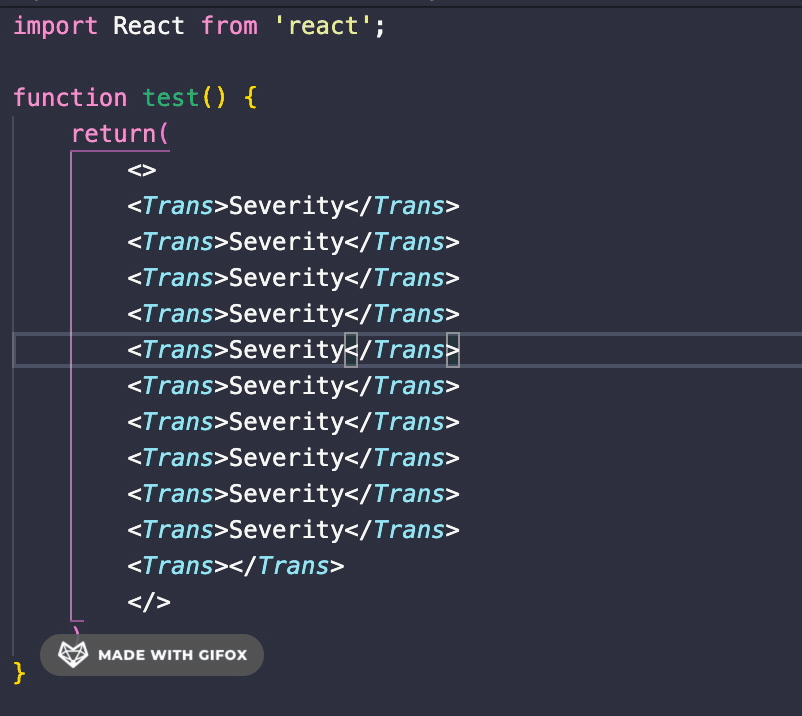

# XTrans README

This is a vscode plugin for i18n quick view

## Features

Auto detect i18n key, show translation via tooltip.

## Requirements

VS Code ^1.42.0

## Extension Settings

This extension contributes the following settings:

* `XTrans.projects`: [{ "name": "PORTAL", "path": "i18n" }]
* `XTrans.flatten`: json file structure

## Release Notes

### 1.0.0

Initial release 

--------------------------------------------------------------------------------------------------------

## Screen shots

